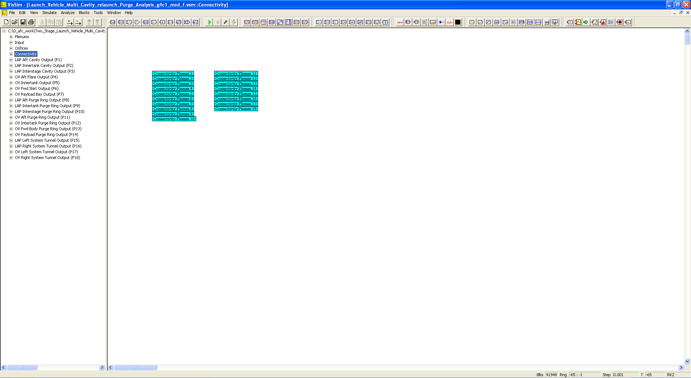

# ========================================
# Two Stage Launch Vehicle Multi Cavity Prelaunch Purge Analysis using VISSIM:
# ========================================

## Two Stage Launch Vehicle Multi Cavity Prelaunch Purge Analysis using VISSIM.

##
## I. Operation: "./VISSIM/Launch_Vehicle_Multi_Cavity_relaunch_Purge_Analysis_g4c1_mod_f.vsm"

##
## II. Prelaunch Purge Analysis Top Level Diagram:

##
## III. Plenums Sub-System Level Diagram:

##
## IV. Input Sub-System Level Diagram:

##
## V. Orifices Sub-System Level Diagram:

##
## VI. Connectivity Sub-System Level Diagram:

##
## VII. LAP AFT Cavity Output Sub-System Level Diagram:

##
## VIII. LAP Innertank Cavity Output Sub-System Level Diagram:

##
## IX. LAP Interstage Cavity Output Sub-System Level Diagram:

##
## X. OV AFT Flare Output Sub-System Level Diagram:

##
## XI. OV Innertank Output Sub-System Level Diagram:

##
## XII. OV FWD Skirt Output Sub-System Level Diagram:

##
## XIII. OV Payload Bay Output Sub-System Level Diagram:

##
## XIV. LAP AFT Purge Ring Output Sub-System Level Diagram:

##
## XV. LAP Innertank Purge Ring Output Sub-System Level Diagram:

##
## XVI. LAP Innerstage Purge Ring Output Sub-System Level Diagram:

##
## XVII. OV AFT Purge Ring Output Sub-System Level Diagram:

##
## XVIII. OV Innertank Purge Ring Output Sub-System Level Diagram:

##
## XIX. OV FWD Body Purge Ring Output Sub-System Level Diagram:

##
## XX. OV Payload Purge Ring Output Sub-System Level Diagram:

##
## XXI. LAP Left System Tunnel Output Sub-System Level Diagram:

##
## XXII. LAP Right System Tunnel Output Sub-System Level Diagram:

##
## XXIII. OV Left System Tunnel Output Sub-System Level Diagram:

##
## XXIV. OV Right System Tunnel Output Sub-System Level Diagram:

##
#### XXVa. Results: "./VISSIM/lap_aft_mdot.out"
#### XXVb. Results: "./VISSIM/lap_aft_plenum.out"
#### XXVc. Results: "./VISSIM/lap_aft_purge_ring_mdot.out"
#### XXVd. Results: "./VISSIM/lap_aft_purge_ring_plenum.out"
#### XXVe. Results: "./VISSIM/lap_aft_purge_ring_temp.out"
#### XXVf. Results: "./VISSIM/lap_aft_purge_ring_vel.out"
#### XXVg. Results: "./VISSIM/lap_aft_temp.out"
#### XXVh. Results: "./VISSIM/lap_aft_vel.out"
#### XXVi. Results: "./VISSIM/lap_innertank_mdot.out"
#### XXVj. Results: "./VISSIM/lap_innertank_plenum.out"
#### XXVk. Results: "./VISSIM/lap_innertank_temp.out"
#### XXVl. Results: "./VISSIM/lap_innertank_vel.out"
#### XXVm. Results: "./VISSIM/lap_interstage_mdot.out"
#### XXVn. Results: "./VISSIM/lap_interstage_plenum.out"
#### XXVo. Results: "./VISSIM/lap_interstage_purge_ring_mdot.out"
#### XXVp. Results: "./VISSIM/lap_interstage_purge_ring_plenum.out"
#### XXVq. Results: "./VISSIM/lap_interstage_purge_ring_temp.out"
#### XXVr. Results: "./VISSIM/lap_interstage_purge_ring_vel.out"
#### XXVs. Results: "./VISSIM/lap_interstage_temp.out"
#### XXVt. Results: "./VISSIM/lap_interstage_vel.out"
#### XXVu. Results: "./VISSIM/lap_intertank_purge_ring_mdot.out"
#### XXVv. Results: "./VISSIM/lap_intertank_purge_ring_plenum.out"
#### XXVw. Results: "./VISSIM/lap_intertank_purge_ring_temp.out"
#### XXVx. Results: "./VISSIM/lap_intertank_purge_ring_vel.out"
#### XXVy. Results: "./VISSIM/lap_left_system_tunnel_mdot.out"
#### XXVz. Results: "./VISSIM/lap_left_system_tunnel_plenum.out"
#### XXVaa. Results: "./VISSIM/lap_left_system_tunnel_temp.out"
#### XXVab. Results: "./VISSIM/lap_left_system_tunnel_vel.out"
#### XXVac. Results: "./VISSIM/lap_right_system_tunnel_mdot.out"
#### XXVad. Results: "./VISSIM/lap_right_system_tunnel_plenum.out"
#### XXVae. Results: "./VISSIM/lap_right_system_tunnel_temp.out"
#### XXVaf. Results: "./VISSIM/lap_right_system_tunnel_vel.out"
#### XXVag. Results: "./VISSIM/ov_aft_flare_mdot.out"
#### XXVah. Results: "./VISSIM/ov_aft_flare_plenum.out"
#### XXVai. Results: "./VISSIM/ov_aft_flare_temp.out"
#### XXVaj. Results: "./VISSIM/ov_aft_flare_vel.out"
#### XXVak. Results: "./VISSIM/ov_aft_purge_ring_mdot.out"
#### XXVal. Results: "./VISSIM/ov_aft_purge_ring_plenum.out"
#### XXVam. Results: "./VISSIM/ov_aft_purge_ring_temp.out"
#### XXVan. Results: "./VISSIM/ov_aft_purge_ring_vel.out"
#### XXVao. Results: "./VISSIM/ov_fwd_body_mdot.out"
#### XXVap. Results: "./VISSIM/ov_fwd_body_plenum.out"
#### XXVaq. Results: "./VISSIM/ov_fwd_body_purge_ring_mdot.out"
#### XXVar. Results: "./VISSIM/ov_fwd_body_purge_ring_plenum.out"
#### XXVas. Results: "./VISSIM/ov_fwd_body_purge_ring_temp.out"
#### XXVat. Results: "./VISSIM/ov_fwd_body_purge_ring_vel.out"
#### XXVau. Results: "./VISSIM/ov_fwd_body_temp.out"
#### XXVav. Results: "./VISSIM/ov_fwd_body_vel.out"
#### XXVaw. Results: "./VISSIM/ov_intertank_mdot.out"
#### XXVax. Results: "./VISSIM/ov_intertank_plenum.out"
#### XXVay. Results: "./VISSIM/ov_intertank_purge_ring_mdot.out"
#### XXVaz. Results: "./VISSIM/ov_intertank_purge_ring_plenum.out"
#### XXVba. Results: "./VISSIM/ov_intertank_purge_ring_temp.out"
#### XXVbb. Results: "./VISSIM/ov_intertank_purge_ring_vel.out"
#### XXVbc. Results: "./VISSIM/ov_intertank_temp.out"
#### XXVbd. Results: "./VISSIM/ov_intertank_vel.out"
#### XXVbe. Results: "./VISSIM/ov_left_system_tunnel_mdot.out"
#### XXVbf. Results: "./VISSIM/ov_left_system_tunnel_plenum.out"
#### XXVbg. Results: "./VISSIM/ov_left_system_tunnel_temp.out"
#### XXVbh. Results: "./VISSIM/ov_left_system_tunnel_vel.out"
#### XXVbi. Results: "./VISSIM/ov_payload_mdot.out"
#### XXVbj. Results: "./VISSIM/ov_payload_plenum.out"
#### XXVbk. Results: "./VISSIM/ov_payload_purge_ring_mdot.out"
#### XXVbl. Results: "./VISSIM/ov_payload_purge_ring_plenum.out"
#### XXVbm. Results: "./VISSIM/ov_payload_purge_ring_temp.out"
#### XXVbn. Results: "./VISSIM/ov_payload_purge_ring_vel.out"
#### XXVbo. Results: "./VISSIM/ov_payload_temp.out"
#### XXVbp. Results: "./VISSIM/ov_payload_vel.out"
#### XXVbq. Results: "./VISSIM/ov_right_system_tunnel_mdot.out"
#### XXVbr. Results: "./VISSIM/ov_right_system_tunnel_plenum.out"
#### XXVbs. Results: "./VISSIM/ov_right_system_tunnel_temp.out"
#### XXVbt. Results: "./VISSIM/ov_right_system_tunnel_vel.out"

## 
## *Note: 
## 1. Performance Data and Analysis performed using VISSIM, ( https://web.solidthinking.com/vissim-is-now-solidthinking-embed )

